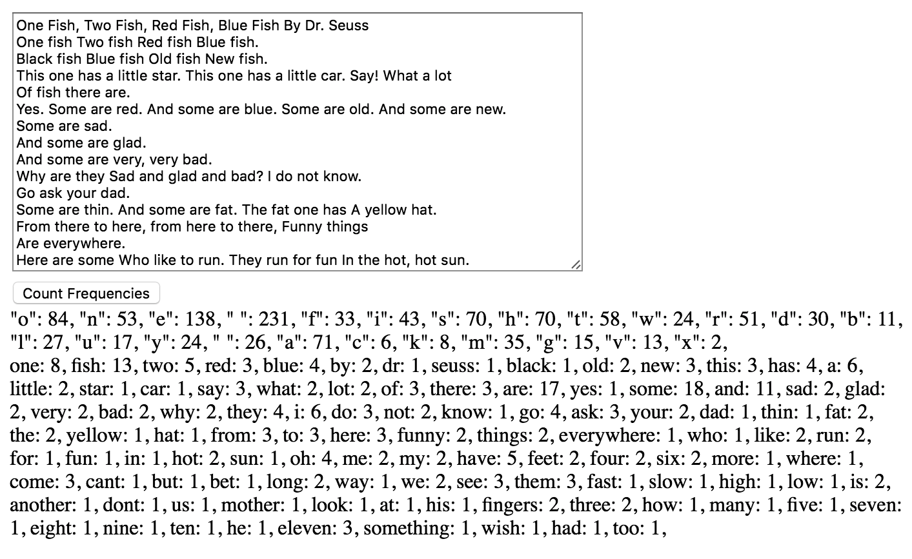

<em>12 - Entrega: Contador de Frequência</em>

<h1>Entrega: Contador de Frequência</h1>

Em qualquer texto, algumas letras serão mais usadas do que outras. Da mesma forma, algumas palavras são mais usadas que outras. Você irá criar uma página web que conta a frequência de diferentes letras e palavras em um bloco de texto.

<strong>Início</strong>

Crie um novo diretório para este projeto. Crie um arquivo index.html e um arquivo .js correspondente.

Em seguida, você precisa de uma maneira de permitir que o usuário insira um texto. O seguinte trecho de HTML define um campo de texto e um botão:

``` 
<textarea rows="15" cols="60" id="textInput"></textarea>
<br />  
<button id="countButton">Count Frequencies</button> 
``` 
Nesta parte, também vamos adicionar dois divs que você pode usar depois para apresentar os resultados:

```
<div id="lettersDiv"></div>
<div id="wordsDiv"></div>
```

O botão que você adicionou anteriormente na verdade ainda não faz nada; você precisa atribuir um handler de clique a ele usando javascript:

```
document.getElementById("countButton").onclick = function() {  
   // teu código vai aqui ... 
}
 ```

Você também precisa de um modo de descobrir o que foi digitado na caixa de texto:

```
let typedText = document.getElementById("textInput").value;
```

E por último, você precisa de uma maneira de ignorar maiúsculas e pontuação. Em uma frase como "Cães gostam de cheirar outros cães!" você precisa que as duas ocorrências da palavra "cães" sejam consideradas como a mesma coisa, mesmo que uma comece em maiúscula e a outra não. Da mesma forma, não importa se uma tem um ponto de exclamação em seguida e a outra não.

 ```
typedText = typedText.toLowerCase(); 
// Isto muda todas as letras para minúsculas
typedText = typedText.replace(/[^a-z'\s]+/g, ""); 
// Isso se livra de todos os caracteres exceto letras comuns, espaços e apóstrofos. 
// Iremos aprender mais sobre como usar a função replace numa lição mais à frente.
```

<strong>Contando letras e palavras</strong>

Você pode indexar em strings da mesma forma que pode indexar em arrays. A expressão typedText[4] retornará o 5º caractere de typedText. Isso significa que você pode escrever um loop em todos os caracteres de typedText dessa forma:

```
for (let i = 0; i < typedText.length; i++) {
   currentLetter = typedText[i];
   // faça algo com cada letra 
}
```

Você usará o conceito de objeto (uma forma de "array associativo") introduzido na última aula para registrar o número de vezes que cada letra é usada no texto.

 ```
const letterCounts = {};
```

Ao encontrar uma letra pela primeira vez, você irá definir a contagem dela como 1. Caso contrário, adicionará um à contagem.

```
if (letterCounts[currentLetter] === undefined) {
   letterCounts[currentLetter] = 1; 
} else { 
   letterCounts[currentLetter]++; 
}
```

Para saber quantas vezes cada letra apareceu, você pode usar um loop for..in em letterCounts.

```
for (let letter in letterCounts) { 
   const span = document.createElement("span"); 
   const textContent = document.createTextNode('"' + letter + "\": " + letterCounts[letter] + ", "); 
   span.appendChild(textContent); 
   document.getElementById("lettersDiv").appendChild(span); 
}
```

Você descobrirá que as letras não são ordenadas de forma alguma. Por enquanto não tem problema, e você pode aprimorar isso depois.

Para produzir o mesmo tipo de contagem de frequência com palavras, você precisa de um modo de separar a string de entrada em palavras separando-a nos espaços. Convenientemente, há uma função incorporada que pode ajudar com isso:

```
words = typedText.split(/\s/);
```

Sabendo disso, veja se você consegue descobrir como adaptar para palavras a lógica de contagem de letras mencionada acima.

<strong>Exemplo concluído</strong>

Aqui está um exemplo básico de uma solução concluída:



<strong>Exemplo de entrada:</strong>

```
One Fish, Two Fish, Red Fish, Blue Fish By Dr. Seuss
One fish Two fish Red fish Blue fish.
Black fish Blue fish Old fish New fish.
This one has a little star. This one has a little car. Say! What a lot
Of fish there are.
Yes. Some are red. And some are blue. Some are old. And some are new.
Some are sad.
And some are very, very bad.
Why are they Sad and glad bad? I do not know.
Go ask your dad.
Some are thin. And some are fato. The fat one has A yellow hat.
From there to here, from here to there, Funny things
Are everywhere.
Here are some Who like to run. They run for fun In the hot, hot sun.
```

<strong>Exemplo de saída:</strong>

```
"o": 36, "n": 23, "e": 63, " ": 114, "f": 21, "i": 22, "s": 38, "h": 37, "t": 29, "w": 10, "r": 34, "d": 19, "b": 8, "l": 16, "u": 11, "y": 12, " ": 13, "a": 39, "c": 2, "k": 4, "m": 11, "v": 3, "g": 3,
"one": 5, "fish": 13, "two": 2, "red": 3, "blue": 4, "by": 1, "dr": 1, "seuss": 1, "black": 1, "old": 2, "new": 2, "this": 2, "has": 3, "little": 2, "star": 1, "car": 1, "say": 1, "what": 1, "lot": 1, "of": 1, "there": 3, "are": 12, "yes": 1, "some": 9, "and": 5, "sad": 2, "very": 2, "bad": 2, "why": 1, "they": 2, "glad": 1, "do": 1, "not": 1, "know": 1, "go": 1, "ask": 1, "your": 1, "dad": 1, "thin": 1, "fato": 1, "the": 2, "fat": 1, "yellow": 1, "hat": 1, "from": 2, "to": 3, "here": 3, "funny": 1, "things": 1, "everywhere": 1, "who": 1, "like": 1, "run": 2, "for": 1, "fun": 1, "in": 1, "hot": 2, "sun": 1,
```

<strong>Bônus</strong>

Há muitas oportunidades de aprimorar a solução básica para deixá-la mais caprichada.

<ul>
<li>Tente ordenar o resultado de alguma forma.</li>
<li>Tente imprimir as letras e palavras por ordem de frequência, da maior para a menor.</li>
<li>Tente ilustrar as frequências relativas com um histograma.</li>
</ul>

<strong>Envio</strong>

Faça o push do código para o seu repositório GitLab e implemente-o via GitLab pages. No Canvas, por favor, envie a url de seu Gitlab Pages (ex: https://nomedeusuario.gitlab.io/frequency-counter/) e, no GitLab, adicione o grupo ka-br-<sua-turma>-correcoes como membro do seu projeto com a permissão "Reporter".